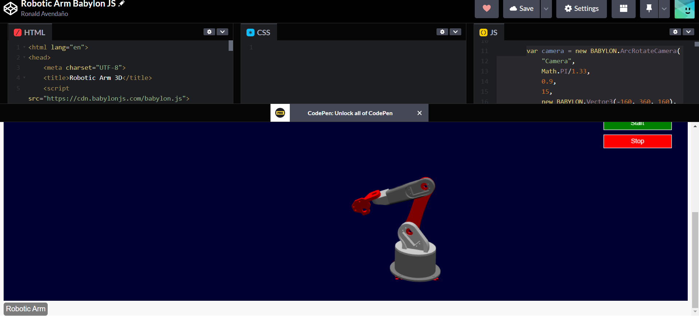

# Proyecto de Simulación 3D - Brazo Robótico

Este proyecto es una simulación 3D de un brazo robótico utilizando la biblioteca Babylon.js. Proporciona una representación visual interactiva de un brazo robótico con varios componentes. Puedes utilizar este README para obtener información sobre cómo configurar y ejecutar el proyecto.

## Demostración en vivo

Puedes ver la demostración en vivo [aquí]([enlace-a-la-demo](https://codepen.io/ronald_avendano/pen/vYvgBWm)).

## Contenido

- [Requisitos](#requisitos)
- [Configuración](#configuración)
- [Ejecución](#ejecución)
- [Personalización](#personalización)
- [Contribución](#contribución)
- [Licencia](#licencia)

## Requisitos

Asegúrate de tener instalados los siguientes requisitos antes de ejecutar el proyecto:

- Navegador web moderno que admita WebGL (se recomienda Google Chrome o Mozilla Firefox).

## Configuración

1. Clona o descarga este repositorio en tu máquina local:

2. Abre el archivo `index.html` en tu navegador web.

## Ejecución

Una vez que hayas configurado el proyecto, simplemente abre `index.html` en tu navegador web. Verás la simulación 3D del brazo robótico y podrás interactuar con ella.

## Personalización

Puedes personalizar este proyecto de las siguientes maneras:

- **Cambiar modelos 3D**: Reemplaza los archivos STL en la carpeta `./models/` con tus propios modelos 3D o modelos con diferentes diseños.
- **Modificar colores y posiciones**: En el código JavaScript del archivo `index.html`, dentro de la función `createScene`, puedes ajustar los colores y las posiciones de los modelos 3D según tus preferencias.
- **Agregar funcionalidades adicionales**: Extiende el proyecto para incluir controles de usuario, animaciones o cualquier otra característica que desees.

## Contribución

Si deseas contribuir a este proyecto, sigue estos pasos:

1. Haz un fork del repositorio.
2. Crea una nueva rama para tu contribución: `git checkout -b mi-contribución`.
3. Realiza tus cambios y realiza commits con mensajes descriptivos.
4. Haz un push de tus cambios a tu fork: `git push origin mi-contribución`.
5. Abre un pull request en este repositorio.

## Licencia

Este proyecto está bajo la Licencia [MIT](LICENSE). Puedes utilizarlo con libertad y modificarlo según tus necesidades.

---

¡Disfruta explorando y personalizando tu simulación 3D del brazo robótico!
